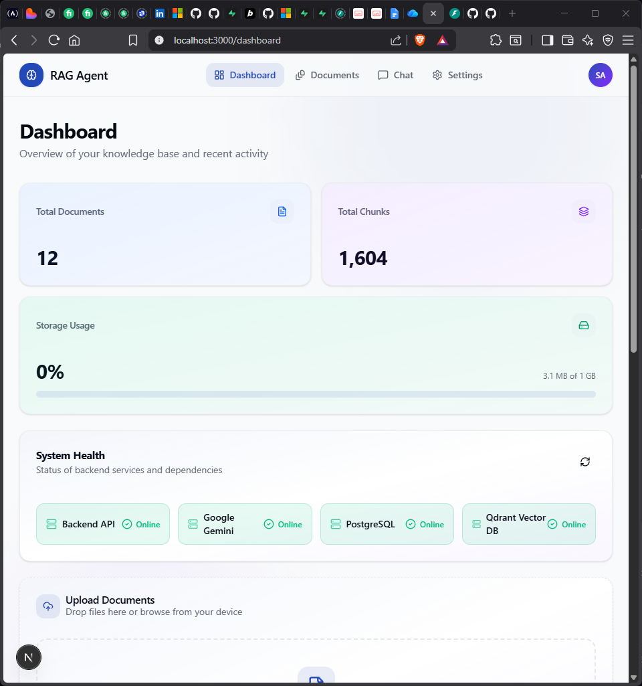
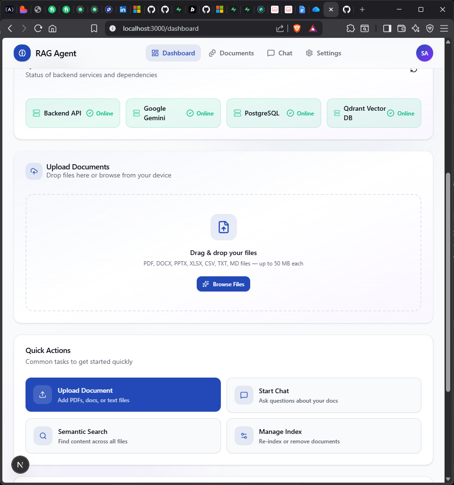
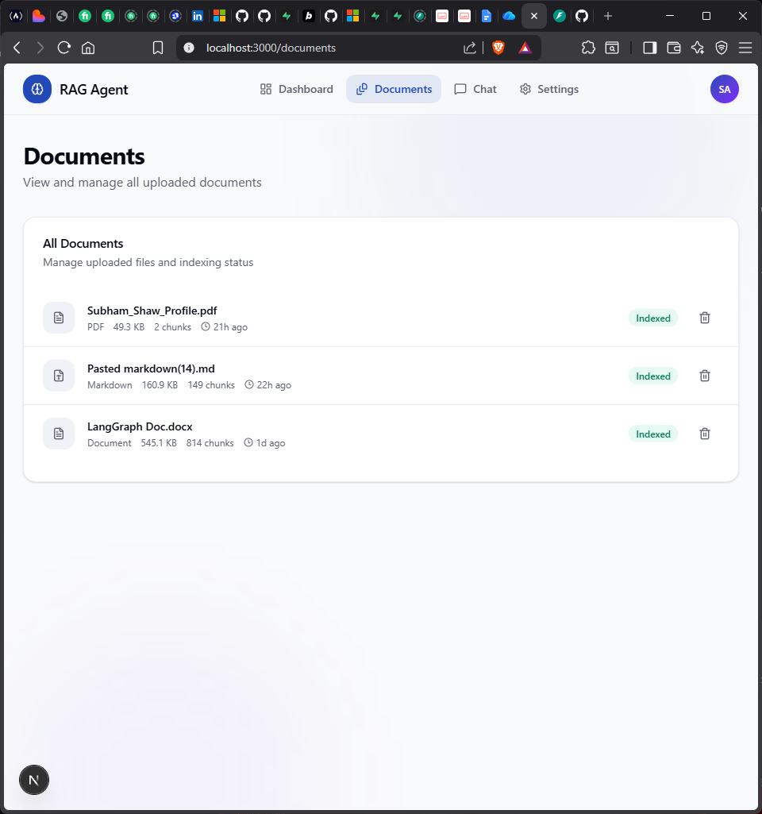
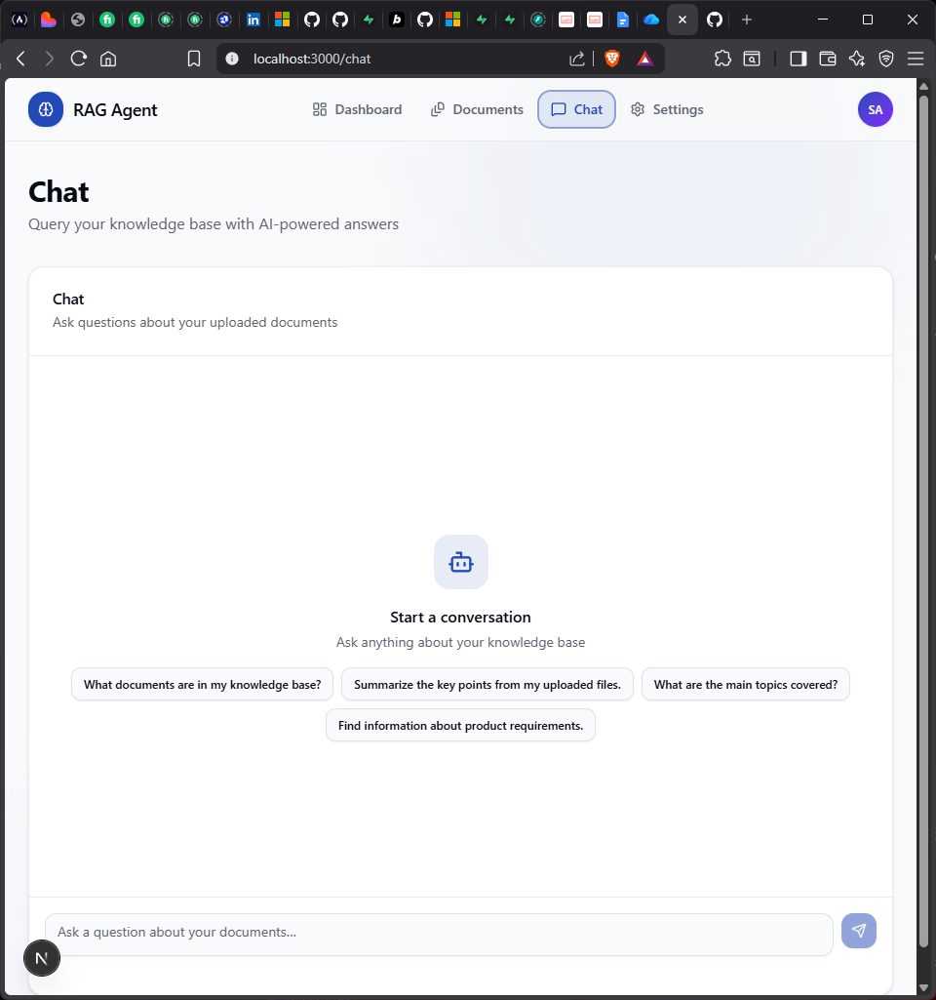

 <div align="center">

# RAGForge

**A Production-Ready Retrieval-Augmented Generation Platform**

Build AI-powered knowledge assistants that ingest, index, retrieve, and reason over documents using **Google Gemini, LangGraph, FastAPI, Next.js, PostgreSQL, and Qdrant.**


<p>
  
  
  
  
  
  
  
  
</p>

</div>

---

## Overview

**Production RAG Agent** is a full-stack, enterprise-ready Retrieval-Augmented Generation (RAG) platform for building intelligent AI assistants over private documents.

Rather than relying solely on an LLM's internal knowledge, the system retrieves relevant information from uploaded documents through semantic search, injects the retrieved context into prompts, and generates grounded responses with source citations.

The platform emphasizes production engineering practices, including resilient document ingestion, deterministic chunking, duplicate detection, retry handling, crash recovery, and scalable vector search.

---

## Highlights

* **Enterprise-Grade RAG Architecture** — Modular, scalable document retrieval and generation pipeline.
* **Multi-Format Document Ingestion** — Process PDF, DOCX, PPTX, XLSX, CSV, TXT, and Markdown files.
* **Google Gemini Integration** — LLM-powered responses and document embeddings.
* **LangGraph Orchestration** — Structured AI workflows for retrieval and generation.
* **FastAPI Backend** — High-performance API for document processing and AI interactions.
* **Next.js + TypeScript Frontend** — Modern, responsive interface for document management and AI chat.
* **PostgreSQL + Qdrant** — Persistent metadata storage and high-dimensional vector search.
* **Adaptive Semantic Chunking** — Configurable chunk sizes, overlap, and deterministic chunk IDs.
* **Resilient Indexing** — Duplicate detection, retry handling, and interrupted indexing recovery.
* **Streaming AI Chat** — Interactive conversations with real-time response generation.
* **Source Citations** — Trace generated answers back to retrieved document chunks.
* **Docker Deployment** — Containerized application infrastructure.
* **Production Health Monitoring** — Visibility into API, database, vector store, and AI provider health.

---

## Features

### Document Processing

Supports uploading and indexing the following formats:

`PDF` · `DOCX` · `PPTX` · `XLSX` · `CSV` · `TXT` · `Markdown`

Every uploaded document passes through an automated processing pipeline:

1. **Validation** — Verify document format and input integrity.
2. **Parsing** — Extract text and content from supported file formats.
3. **Chunking** — Split content into manageable, context-preserving segments.
4. **Embedding** — Generate vector representations using the configured embedding model.
5. **Indexing** — Store vectors in Qdrant for semantic retrieval.
6. **Persistence** — Store document metadata and processing information in PostgreSQL.

---

### Adaptive Semantic Chunking

A production-oriented chunking pipeline designed for efficient retrieval and reliable indexing.

* Recursive chunk splitting
* Configurable chunk size
* Configurable chunk overlap
* Deterministic chunk IDs
* Duplicate document detection
* Resumable indexing after interruptions

---

### Retrieval-Augmented Generation

The system retrieves relevant document context before generating an answer, reducing reliance on the LLM's parametric knowledge alone.

**Query Processing Pipeline**

1. **User Query** — The user submits a question through the chat interface.
2. **Semantic Retrieval** — Qdrant searches for relevant document chunks.
3. **Context Construction** — LangGraph orchestrates the retrieval and assembles contextual information.
4. **Answer Generation** — Google Gemini generates a response grounded in the retrieved context.
5. **Source Attribution** — Relevant document sources are returned alongside the answer.

---

### Resilient Embedding Pipeline

A fault-tolerant embedding workflow designed to handle external AI provider constraints and interruptions.

* Dynamic batch sizing
* Exponential backoff
* Retry with jitter
* Adaptive batch reduction
* Concurrency control
* Duplicate-safe processing

> **Note:** When using the Google Gemini Free Tier, very large documents may take several minutes to finish embedding due to provider quota limits. Background asynchronous processing is planned for a future release.

---

### AI Chat

An interactive conversational interface powered by retrieval-augmented generation.

* Conversational RAG
* Streaming responses
* Markdown rendering
* Code block formatting
* Copy response
* Source citations

---

### Document Management

Centralized document operations and indexing visibility.

* Upload documents
* Delete documents
* Duplicate detection
* Already-indexed document detection
* Chunk statistics
* Document metadata

---

### Dashboard

A centralized monitoring dashboard providing visibility into application health and document indexing statistics.

* Backend API health
* Google Gemini connectivity
* PostgreSQL status
* Qdrant status
* Total document count
* Total chunk count
* Storage usage

---

# Architecture

The application follows a modular architecture, separating the frontend, backend, AI orchestration, and data storage layers. The Next.js frontend communicates with the FastAPI backend through REST and streaming APIs, while LangGraph orchestrates the RAG pipeline using Google Gemini, PostgreSQL, and Qdrant.

```text
                         User
                           │
                           ▼
                 ┌────────────────────┐
                 │   Next.js Frontend │
                 │  React / TypeScript│
                 └─────────┬──────────┘
                           │
                   REST / Streaming API
                           │
                           ▼
                 ┌───────────────────┐
                 │   FastAPI Backend │
                 │                   │
                 └─────────┬─────────┘
                           │
              ┌────────────┼────────────┐
              │            │            │
              ▼            ▼            ▼
       ┌────────────┐ ┌───────────┐ ┌───────────┐
       │ Google     │ │PostgreSQL │ │  Qdrant   │
       │ Gemini     │ │           │ │           │
       │            │ │ Metadata  │ │  Vector   │
       │ LLM        │ │ Storage   │ │  Store    │
       └──────┬─────┘ └─────┬─────┘ └─────┬─────┘
              │             │             │
              └─────────────┼─────────────┘
                            │
                            ▼
                 ┌────────────────────┐
                 │   LangGraph RAG    │
                 │                    │
                 │ Retrieval &        │
                 │ AI Orchestration   │
                 └────────────────────┘
```

---

# Technology Stack

The system combines a modern web framework, asynchronous backend APIs, AI orchestration, and specialized databases to support document ingestion, semantic retrieval, and AI-powered conversations.

### Frontend

| Technology   | Purpose                                    |
| ------------ | ------------------------------------------ |
| Next.js      | Frontend framework and application routing |
| React        | Component-based user interface             |
| TypeScript   | Type-safe application development          |
| Tailwind CSS | Responsive styling and UI design           |

### Backend

| Technology | Purpose                               |
| ---------- | ------------------------------------- |
| FastAPI    | REST APIs and streaming responses     |
| LangGraph  | RAG workflow orchestration            |
| SQLAlchemy | Database models and ORM               |
| Pydantic   | Data validation and schema management |

### AI & Retrieval

| Technology                     | Purpose                                           |
| ------------------------------ | ------------------------------------------------- |
| Google Gemini                  | Large language model for AI-generated responses   |
| Semantic Embeddings            | Representing documents and queries as vectors     |
| Retrieval-Augmented Generation | Grounding responses in retrieved document content |

### Databases

| Technology | Purpose                                           |
| ---------- | ------------------------------------------------- |
| PostgreSQL | Persistent application data and document metadata |
| Qdrant     | Vector storage and semantic similarity search     |

### DevOps & Deployment

| Technology     | Purpose                                  |
| -------------- | ---------------------------------------- |
| Docker         | Containerization of application services |
| Docker Compose | Local multi-container orchestration      |

---

# Application Preview

The application provides a centralized interface for managing documents, monitoring the workspace, and interacting with an AI-powered document retrieval system.

### Dashboard

The main dashboard provides an overview of the application and its document workspace.



---

### Document Upload

Upload documents to make their content available for indexing, retrieval, and AI-powered querying.



---

### Document Management

Browse and manage uploaded documents through a dedicated document interface.



---

### AI Chat

Interact with the AI assistant to ask questions and retrieve relevant information from uploaded documents.



---

# Getting Started

Follow these steps to clone the repository, configure the required environment variables, and run the application locally.

### 1. Clone the Repository

```bash
git clone https://github.com/rounakkumarsah/Production-RAG-Agent.git
cd Production-RAG-Agent
```

### 2. Configure Environment Variables

Create the environment files in the project root and backend directory.

```bash
.env
backend/.env
```

Use the provided example files as templates:

```bash
.env.example
backend/.env.example
```

Configure the required credentials and connection settings:

* **Google Gemini:** API key for language model access.
* **PostgreSQL:** Database connection credentials.
* **Qdrant:** Vector database connection settings.

Ensure that the environment variables match the configuration expected by the application.

### 3. Start the Backend

Navigate to the backend directory and launch the services using Docker Compose.

```bash
cd backend
docker compose up --build
```

This builds and starts the backend services defined in the Docker Compose configuration.

### 4. Start the Frontend

Open a separate terminal, navigate to the project root, install the dependencies, and start the Next.js development server.

```bash
cd ..
npm install
npm run dev
```

### 5. Access the Application

Once the frontend and backend are running, access the application and API endpoints locally.

| Service                   | URL                        |
| ------------------------- | -------------------------- |
| Frontend                  | http://localhost:3000      |
| Backend                   | http://localhost:8000      |
| Swagger API Documentation | http://localhost:8000/docs |

---


# Project Structure

```text
Production-RAG-Agent/
│
├── app/                       # Frontend application
│
├── backend/                   # Backend services and API
│   ├── app/                   # Core application logic
│   ├── services/              # RAG and business services
│   ├── api/                   # REST API endpoints
│   ├── docker-compose.yml     # Container orchestration
│   └── requirements.txt       # Python dependencies
│
├── components/                # Reusable UI components
├── lib/                       # Shared utilities and helpers
├── public/                    # Static assets
├── package.json               # Frontend dependencies
├── next.config.ts             # Next.js configuration
└── README.md                  # Project documentation
```

---

# Production Engineering Features

The system incorporates production-oriented engineering practices to improve reliability, scalability, and fault tolerance across the document ingestion and retrieval pipeline.

| Feature                            | Description                                                                                       |
| ---------------------------------- | ------------------------------------------------------------------------------------------------- |
| **Deterministic Chunk IDs**        | Generates consistent identifiers for document chunks, enabling reliable indexing and updates.     |
| **Duplicate Document Detection**   | Identifies previously ingested documents to prevent redundant processing and storage.             |
| **Resumable Indexing**             | Continues interrupted indexing operations without unnecessarily reprocessing completed documents. |
| **Adaptive Batch Embedding**       | Dynamically adjusts embedding batch sizes to accommodate available resources and API constraints. |
| **Exponential Backoff & Retry**    | Handles transient failures through progressively increasing retry intervals.                      |
| **Dynamic Batch Reduction**        | Reduces batch sizes when resource limitations or API errors occur during processing.              |
| **Similarity Threshold Filtering** | Filters retrieved chunks based on relevance scores to improve context quality.                    |
| **Streaming Responses**            | Streams generated responses incrementally to reduce perceived latency.                            |
| **Health Monitoring**              | Exposes application health information to support service monitoring and diagnostics.             |
| **Dockerized Deployment**          | Containerizes application services for consistent deployment and environment management.          |

---

# Roadmap

The following enhancements are planned to extend the system's scalability, security, observability, and deployment capabilities.

| Status | Planned Enhancement                                                              |
| ------ | -------------------------------------------------------------------------------- |
| [ ]    | Background Workers for asynchronous document processing                          |
| [ ]    | Asynchronous Upload Queue for handling concurrent ingestion requests             |
| [ ]    | Redis Cache for faster retrieval and reduced repeated computation                |
| [ ]    | User Authentication for secure access to the application                         |
| [ ]    | Multi-Tenant Support for isolated user and organizational data                   |
| [ ]    | Role-Based Access Control (RBAC) for granular permissions                        |
| [ ]    | Observability Dashboard for monitoring system performance and operations         |
| [ ]    | Kubernetes Deployment for container orchestration and scaling                    |
| [ ]    | CI/CD Pipeline for automated testing, integration, and deployment                |
| [ ]    | Automated Evaluation Suite for measuring retrieval quality and response accuracy |

---

# Learning Objectives

This project provides hands-on experience in designing, developing, and deploying a full-stack Retrieval-Augmented Generation system, with an emphasis on practical AI engineering and production software development.

**Core AI & Retrieval**

* Retrieval-Augmented Generation (RAG)
* AI Engineering and LLM Application Development
* Vector Databases and Semantic Search
* LangGraph-Based Agent Workflows
* Google Gemini API Integration

**Backend & Infrastructure**

* Production-Ready FastAPI Development
* REST API Design and Integration
* PostgreSQL and Qdrant Integration
* Docker-Based Containerization and Deployment
* Fault Tolerance, Retry Mechanisms, and Resource Management

**Full-Stack & System Design**

* Full-Stack AI Application Development
* Next.js and TypeScript
* Frontend and Backend Integration
* Scalable Application Architecture
* Enterprise Software Engineering Practices

---

# Contributing

Contributions, suggestions, and improvements are welcome.

To contribute to the project:

1. **Fork** the repository to your GitHub account.
2. **Create a feature branch** for your changes.
3. **Implement and test** your changes locally.
4. **Commit and push** your changes to your fork.
5. **Open a Pull Request** describing your contribution.

Please ensure that your changes are tested and documented before submitting a pull request.

---

# License

This project is licensed under the **MIT License**. You are free to use, modify, and distribute the software in accordance with the terms of the license.

---

# Author

## Rounak Kumar Sah

**AI Automation Engineer | AI Agent Developer | GenAI Engineer**

### Tech Stack

| Category                  | Technologies             |
| ------------------------- | ------------------------ |
| **Programming**           | Python, TypeScript       |
| **Backend**               | FastAPI                  |
| **AI & Agent Frameworks** | LangGraph, Google Gemini |
| **Frontend**              | Next.js                  |
| **Databases**             | PostgreSQL, Qdrant       |
| **Infrastructure**        | Docker                   |
| **Automation**            | n8n                      |

---

<div align="center">

If you find this project useful, consider giving the repository a **Star**.

</div>
